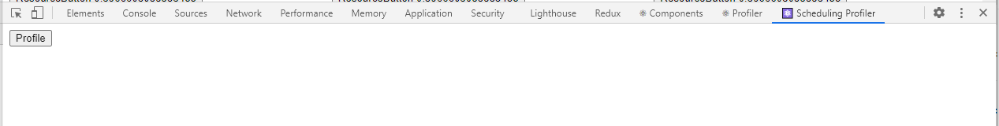
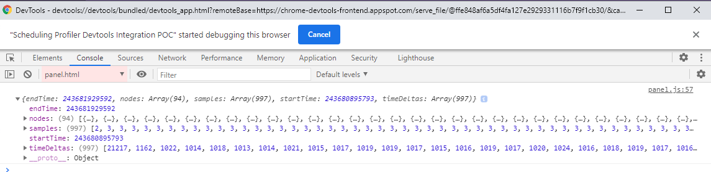

# React Scheduling Profiler DevTools Integration POC

Demonstrates the programmatic recording of a performance profile from a
Chrome extension using the Chrome DevTools Protocol.

This is intended as an initial step towards integrating the [React concurrent
mode scheduling profiler](https://react-scheduling-profiler.vercel.app/) into
the main React DevTools.

Context:

- https://github.com/MLH-Fellowship/scheduling-profiler-prototype/issues/56
- https://github.com/MLH-Fellowship/scheduling-profiler-prototype/issues/57

Relevant code located in [panel.js](panel.js).

## Installation

1. Clone this repository.
2. In Chrome, navigate to <chrome://extensions/>.
3. Use the "Load unpacked" button to load the cloned repository folder.

## Usage

1. On a new Chrome tab, open Chrome DevTools.
1. Navigate to the Scheduling Profiler tab.
   
1. Open a new DevTools window for the Scheduling Profiler tab, and navigate to its Console tab.
1. Observe a profile that was recorded when the panel was mounted.
1. Click the Profile button to record another 1-second profile. To modify the
   profile duration, change the timeout duration in panel.js.
   
